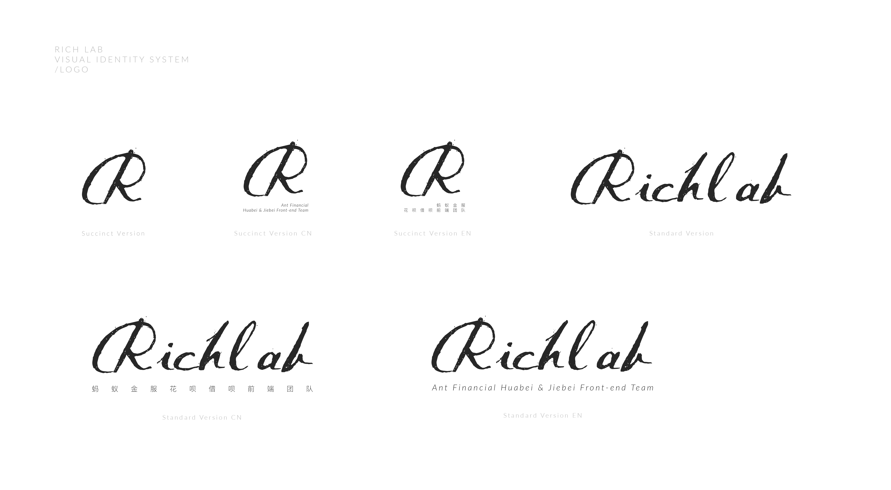
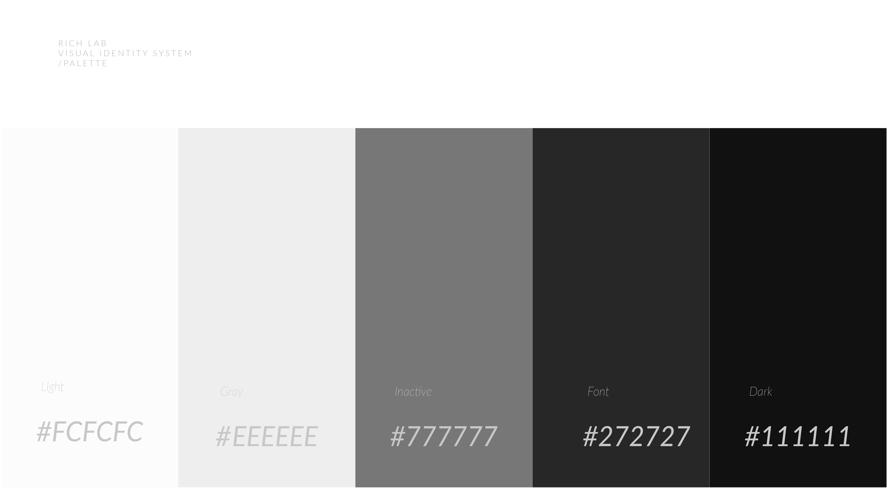

# Visual Identity of RichLab

- [Logo](#logo)
  - [Light Version](#light-version)
  - [Dark Version](#dark-version)
- [Palette](#palette)
  - [Main](#main-palette)

## Logo

### Light Version

#### light_logo_version_overview

#### light_logo_standard_version

  

#### light_logo_standard_version_cn

  

#### light_logo_standard_version_en

  

#### logo_succinct_version

  

#### logo_succinct_version_cn

  

#### logo_succinct_version_en

  

### DARK VERSION

#### dark_logo_standard_version

  

#### dark_logo_standard_version_cn

  

#### dark_logo_standard_version_en

  

#### logo_succinct_version

  

#### logo_succinct_version_cn

  

#### logo_succinct_version_en

  

## Palette

### Main Palette

