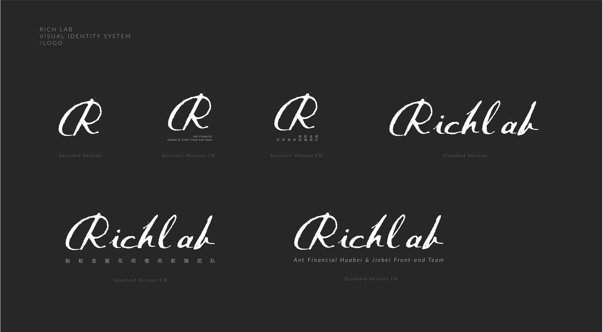

# Visual Identity of RichLab

- [Logo](#logo)
  - [Dark Version](#dark-version)
  - [Dark Version Transparent](#dark-version-transparent)
  - [Light Version](#light-version)
  - [Light Version Transparent](#light-version-transparent)
- [Palette](#palette)
  - [Main Palette](#main-palette)
    - [Main Palette Less Code](#main-palette-less-code)
    - [Main Palette Stylus Code](#main-palette-stylus-code)
  

## Logo


### Dark Version

#### dark_logo_version_overview




#### dark_logo_standard_version

<p align="center">
  
</p>

#### dark_logo_standard_version_cn

<p align="center">
  
</p>

#### dark_logo_standard_version_en

<p align="center">
  
</p>


#### dark_logo_succinct_version

<p align="center">
  
</p>

#### dark_logo_succinct_version_cn

<p align="center">
  
</p>

#### dark_logo_succinct_version_en

<p align="center">
  
</p>

### Dark Version Transparent

#### dark_logo_standard_version_transparent

<p align="center">
  
</p>

#### dark_logo_standard_version_cn_transparent

<p align="center">
  
</p>

#### dark_logo_standard_version_en_transparent

<p align="center">
  
</p>


#### dark_logo_succinct_version_transparent

<p align="center">
  
</p>

#### dark_logo_succinct_version_cn_transparent

<p align="center">
  
</p>

#### dark_logo_succinct_version_en_transparent

<p align="center">
  
</p>


### Light Version

#### light_logo_version_overview


#### light_logo_standard_version

<p align="center">
  
</p>

#### light_logo_standard_version_cn

<p align="center">
  
</p>

#### light_logo_standard_version_en

<p align="center">
  
</p>


#### light_logo_succinct_version

<p align="center">
  
</p>

#### light_logo_succinct_version_cn

<p align="center">
  
</p>

#### light_logo_succinct_version_en

<p align="center">
  
</p>


### Light Version Transparent

#### light_logo_standard_version_transparent

<p align="center">
  
</p>

#### light_logo_standard_version_cn_transparent

<p align="center">
  
</p>

#### light_logo_standard_version_en_transparent

<p align="center">
  
</p>


#### light_logo_succinct_version_transparent

<p align="center">
  
</p>

#### light_logo_succinct_version_cn_transparent

<p align="center">
  
</p>

#### light_logo_succinct_version_en_transparent

<p align="center">
  
</p>

## Palette

### Main Palette


### Main Palette Less Code

```less
/* HSL */
@color-light: hsla(0%, 0%, 99%, 1);
@color-gray: hsla(0%, 0%, 93%, 1);
@color-inactive: hsla(0%, 0%, 47%, 1);
@color-font: hsla(0%, 0%, 15%, 1);
@color-dark: hsla(0%, 0%, 7%, 1);

/* RGB */
@color-light: rgba(252, 252, 252, 1);
@color-gray: rgba(238, 238, 238, 1);
@color-inactive: rgba(119, 119, 119, 1);
@color-font: rgba(39, 39, 39, 1);
@color-dark: rgba(17, 17, 17, 1);
```

### Main Palette Stylus Code

```stylus
/* HSL */
@color-light = hsla(0%, 0%, 99%, 1);
@color-gray = hsla(0%, 0%, 93%, 1);
@color-inactive = hsla(0%, 0%, 47%, 1);
@color-font = hsla(0%, 0%, 15%, 1);
@color-dark = hsla(0%, 0%, 7%, 1);

/* RGB */
@color-light = rgba(252, 252, 252, 1);
@color-gray = rgba(238, 238, 238, 1);
@color-inactive = rgba(119, 119, 119, 1);
@color-font = rgba(39, 39, 39, 1);
@color-dark = rgba(17, 17, 17, 1);
```
